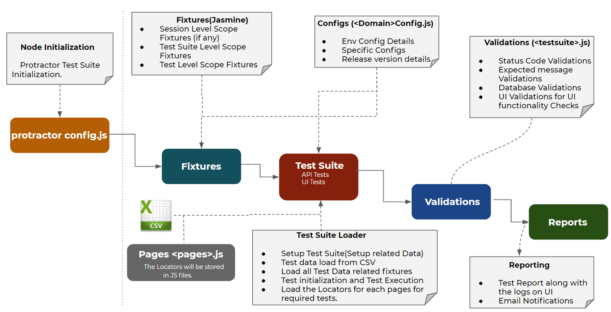

#MARS - VCA Overview
- VCA is fully owned Business Unit/Banner of Mars Inc.
- Mars Inc also owns other petcare service providers such as Banfield, Bluepearl, Antech etc.

#Project Voyager Overview
- Before jumping on the AS-IS Understanding of the PMS system
- It's important to understand the journey which Mars-VCA has decided to Voyage.
- Woofware is a system that was developed in house by VCA over a period of 10+ years and has been highly customized to be used by hospital users.
- The product was developed on legacy technology stack and has quite a bit of limitations.
- Mars-VCA has a vision to create a new PMS platform which will be based on the latest scalable technologies as well as can be used across all Business Units/Banners of Mars such as VCA, Banfield etc.
- But to start the Journey, Mars has decided to replace PMS System to VCA to start with as Banfield uses a different PMS system and will be onboarded in this journey at a later stage.
- The Project is named as “Project Voyager”.
- The journey is being seen as Mars-VCA as a digital transformation journey which will not only resolve current system limitations but will also help them to sell this platform to other PetCare Vendors.

#Woofware Work Streams
###Woofware is used across multiple work streams. Woofware Supports processes across work streams :
- CRM - Corporate Setup ,Hospital Setup, Client/Patient Management, Client/Patient Search, Woofware Queues
- Visits - Scheduler, Appointment Booking and Management
- Patient Treatment and Records - Patient Check In /Walkin, Patient Checkout ,Follow ups
- Financials - Invoicing, Discounts, Charges Validation ,Register Management,Client Financial Management
- Reporting- Hospital Reporting - Pre defined reports ,Ad Hoc reporting - BI
- Communication - Communication Log, Communication Tasks, Reminders,
- Product Catalog - Product Codes creation and Management , Messenger

#Summary of Voyager API framework
- Voyager API framework is just what the name implies.
- Voyager API framework holds already established code, structure, procedures, classes, and functions.
- The framework can be used in any programming language such as JavaScript.
- Voayeger API framework is developed in Axios.

#REST API
- REST is an anagram for Representional State Trasnfer
- What that means is an API will transfer to your API a representation of the state of the resource
- As an example, your API contacts Voyager API to request a user
- REST forwards that Schedule and Appointment,Client and Patients,User and Staffs, Code Catalog and much more
- Your API might use REST API if you were an book and Appointment for Pets like Voyager.
- You can build your API yourself, concentrating on security, URL templates, return links, status codes, and more
- This is the most time-consuming and expensive part of the API process. However, it doesn’t have to be like that
- You can use a program that does it all for you, while you concentrate on managing the API.

#Axios Overview
- Axios is a promise-based HTTP client that works both in the browser and in a Node.js environment.
- It provides a single API for dealing with XMLHttpRequests and node’s http interface.
- Axios makes it easy to send asynchronous HTTP requests to REST endpoints and perform CRUD operations.
- It can be used in plain JavaScript or with a library such as Vue or React.

#Installation

###Installing Axios is easy and only requires two steps:
1. Install Axios- npm install axios –save
2. After downloading, on top of the JS file that you plan to use Axios on, add the line - import axios from ‘axios’;

#Automation Flow Diagram (API and UI)

#Features of the Framework
- Voyager API framework is developed in Axios intergated with Protractor and Cosmos Database(which is requires the library '@azure/cosmos') for validation which runs on Node.js

#Folder Structure
- Configuration - In this folder kept all the js file which defines the Database connectivity
- DAO(Data Access Object)- The Data Access Object (DAO) pattern is a structural pattern that allows us to isolate the application/business layer from the persistence layer (usually a relational database, but it could be any other persistence mechanism) using an abstract API.
- Logger - This is a conversion of the log4js framework to work with node.It generates logs. we can install the log4js as "npm install log4js".
- Pages- This defines the Page Object Model (POM) is a design pattern.The advantage of the model is that it reduces code duplication and improves test maintenance.
- Reports- This defines the reporting for API and UI framework Test results. For that we are using the Allure report. Allure Framework is a flexible lightweight multi-language test report tool that not only shows a very concise representation of what have been tested in a neat web report formWe can install the allure dependency as "npm install -g allure-commandline --save-dev".
- Testdata- Test data is data which has been specifically identified for use in tests. We are using json test data for API and UI framework.
- Testsuites- Test suite is a container that has a set of tests which helps testers in executing and reporting the test execution status. We kept all the Test cases in different js file and for execution we run separate js file or run wholes js file(Test suite) by "protractor <config file>".
- config - The configuration file tells Protractor how to set up the Selenium Server, which tests to run, how to set up the browsers, and which test framework to use. The configuration file can also include one or more global settings.
- package.json - All npm packages contain a file, usually in the project root, called package.json - this file holds various metadata relevant to the project.This file is used to give information to npm that allows it to identify the project as well as handle the project's dependencies.

#For a more complete package.json for Voyager API and UI framework, we can check out underscore:
"testsmoke": "protractor config.js",\
"webdriver-update":"./node_modules/.bin/webdriver-manager update",\
"webdriver-start": "./node_modules/.bin/webdriver-manager start",\
"test": "./node_modules/.bin/protractor config.js",\
"start": "npm run webdriver-update &&npm run webdriver-start",\
"testregression": "protractor config.js --grep=@regression",\
"axios": "0.19.2",\
"config.ini": "0.0.60",\
"protractor": "^5.4.3",\
"xlsx": "^0.15.5",\
"@azure/cosmos": "3.5.2",\
"allure-commandline": "^2.13.0",\
"jasmine-allure-reporter": "1.0.2",\
"log4js": "6.1.2",\
"iniparser": "1.0.5",\
"documentdb": "^1.6.0"\